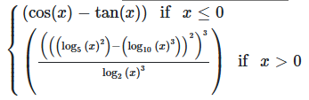
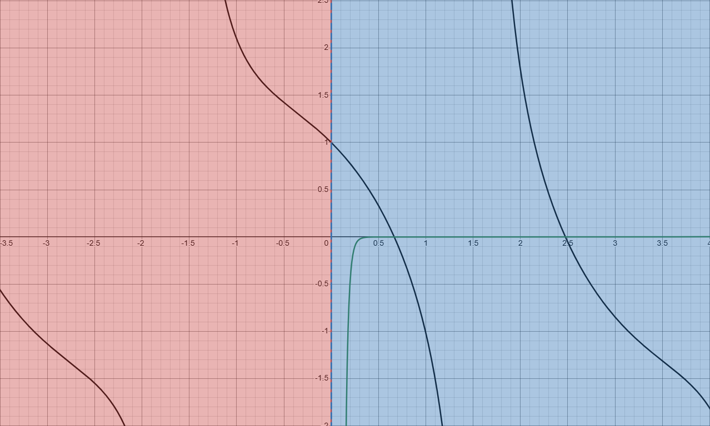
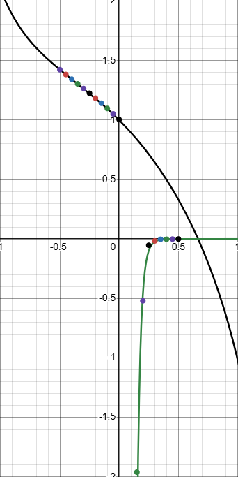

## Лабораторная работа 2 по предмету "Тестированию программного обеспечения"

### Задание

Правила выполнения работы:

Все составляющие систему функции (как тригонометрические, так и логарифмические) должны быть выражены через базовые (тригонометрическая зависит от варианта; логарифмическая - натуральный логарифм).

Структура приложения, тестируемого в рамках лабораторной работы, должна выглядеть следующим образом (пример приведён для базовой тригонометрической функции sin(x)):

Обе "базовые" функции (в примере выше - sin(x) и ln(x)) должны быть реализованы при помощи разложения в ряд с задаваемой погрешностью. Использовать тригонометрические / логарифмические преобразования для упрощения функций ЗАПРЕЩЕНО.

Для КАЖДОГО модуля должны быть реализованы табличные заглушки. При этом, необходимо найти область допустимых значений функций, и, при необходимости, определить взаимозависимые точки в модулях.

Разработанное приложение должно позволять выводить значения, выдаваемое любым модулем системы, в сsv файл вида «X, Результаты модуля (X)», позволяющее произвольно менять шаг наращивания Х. Разделитель в файле csv можно использовать произвольный.

### Порядок выполнения работы:

Разработать приложение, руководствуясь приведёнными выше правилами.

С помощью JUNIT5 разработать тестовое покрытие системы функций, проведя анализ эквивалентности и учитывая особенности системы функций. Для анализа особенностей системы функций и составляющих ее частей можно использовать сайт https://www.wolframalpha.com/.

Собрать приложение, состоящее из заглушек. Провести интеграцию приложения по 1 модулю, с обоснованием стратегии интеграции, проведением интеграционных тестов и контролем тестового покрытия системы функций.

### Выполнение

Точки разрыва: ``−π/2,−3π/2, ..., 1``

Стратегия интеграции: тестирование базовых функций -> тестирование производных функций

### Доделать
Перевести всё на моки (так что значения брались из csv export)
Сделать интаграцию cos (mocksin), (realsin); tan (mockcos, mocksin), (realcos, realsin)
